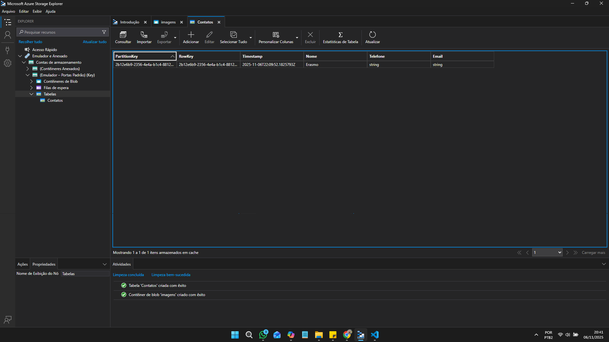
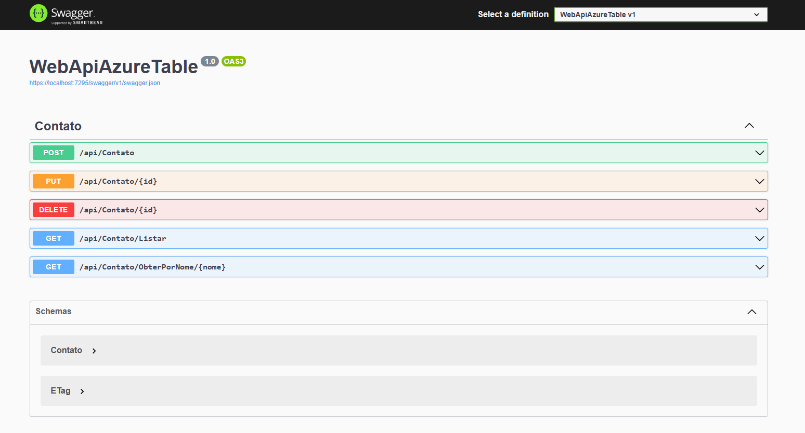

# 🚀 WebApiAzureTable

Projeto desenvolvido no curso "Armazenamento de Dados na Azure" com ASP.NET Core que demonstra o uso do Azure Table Storage para persistência de contatos.

## 🎯 Objetivo

Este projeto implementa uma Web API simples para gerenciar contatos (`Contato`) utilizando o SDK `Azure.Data.Tables`. Serve como referência para aprender como integrar aplicações .NET com Azure Table Storage (Storage Account / Tables).

## 🏗️ Estrutura do projeto

- `Controllers/ContatoController.cs` — Endpoints REST para CRUD de contatos.
- `Models/Contato.cs` — Modelo que implementa `ITableEntity` para uso com Azure Tables.
- `Program.cs` — Configuração mínima do ASP.NET Core (Controllers, Swagger).
- `appsettings.json` / `appsettings.Development.json` — Configurações (conexões, logging).

## 🧰 Tecnologias

- .NET 9 (SDK)
- C#
- Azure.Data.Tables (SDK do Azure para Table Storage)
- Swagger (OpenAPI) para exploração dos endpoints em desenvolvimento

## ✅ Requisitos

- .NET 9 SDK instalado
- Conta Azure com Storage Account (ou Azurite para desenvolvimento local)

## ☁️ Como criar uma Azure Table Storage

- Crie uma Conta de Armazenamento no portal do Azure.
- Acesse o recurso Conta de Armazenamento
- Em "Tables" (ou usando Storage Explorer) crie a tabela `Contatos`.
-> Em "Chaves de acesso" -> copie a string de conexão.

## ▶️ Conecte sua aplicação com sua Conta de Armazenamento

```powershell
# No terminal, Clone o repositorio
git clone https://github.com/erasmobezerra/WebApiAzureTable

# No terminal, Restaure as dependencias
cd ./WebApiAzureTable
dotnet restore

# Configurar `appsettings.Development.json`
# Na raiz do projeto, edite ou crie um arquivo 'appsettings.Development.# json' e inclua o json abaixo lembrando de incluir a string de conexão da sua conta de armazenamento em {string_de_conexao_conta_de_armazenamento}

{
  "Logging": {
    "LogLevel": {
      "Default": "Information",
      "Microsoft.AspNetCore": "Warning"
    }
  },
  "ConnectionStrings": {
    "SAConnectionString": "{string_de_conexao_conta_de_armazenamento}",
    "AzureTableName": "Contatos"
  }
}


# No terminal, Execute o projeto
dotnet watch run

# O ambiente de desenvolvimento do Swagger estará disponível em `https://localhost:7295/swagger/index.html`.
```


## Usar o Azurite para simular Azure Table Storage

Para evitar custos com recursos do Azure, você pode simular uma conta de armazenamento local com o **Azurite**. Sigo os passos a seguir:

#### 1. Configurar `appsettings.Development.json`

Na raiz do projeto, edite ou crie um arquivo 'appsettings.Development.json' e inclua o json abaixo que contém a string de conexão e o nome do container:

```bash
{
  "Logging": {
    "LogLevel": {
      "Default": "Information",
      "Microsoft.AspNetCore": "Warning"
    }
  },
  "ConnectionStrings": {
    "SAConnectionString": "UseDevelopmentStorage=true",
    "AzureTableName": "Contatos"
  }
}
```

#### 2. Instalar Azurite

Para evitar custos com recursos do Azure, você pode simular uma conta de armazenamento local com o **Azurite**:

```bash
npm install -g azurite
```

#### 3. Executar Azurite

```bash
azurite
```

#### 4. Crie o container com o Azure Storage Explorer

Baixe e instale o Azure Storage Explorer. Em Explorer, acesse Conta de Armazenamento > Emulador - Portas Padrão Local > Tabelas e crie em "Criar Tabela" nomeando como : "Contatos".



#### 5. Abra outro terminal no mesmo diretório raiz e execute o projeto

```bash
dotnet watch run
```

## 🔌 Endpoints disponíveis

Base URL: `https://localhost:{port}/api/Contato`

- POST `/api/Contato` — Criar contato (body: `Contato`)
- PUT `/api/Contato/{id}` — Atualizar contato (id = RowKey)
- GET `/api/Contato/Listar` — Listar todos os contatos
- GET `/api/Contato/ObterPorNome/{nome}` — Filtrar por nome
- DELETE `/api/Contato/{id}` — Deletar contato (id = RowKey)



## 🤝 Como contribuir

1. Crie uma branch com nome descritivo: `feature/minha-mudanca`.  
2. Faça commits pequenos e claros.  
3. Abra Pull Request descrevendo o que foi alterado e por quê.  

----

🙏 Agradeço profundamente à **Digital Innovation One** por proporcionar este aprendizado gratuito e de qualidade. Um reconhecimento especial ao professor **[Leonardo Buta](https://www.linkedin.com/in/leonardo-buta/)** pela excelente didática e orientação durante todo o processo.

<div align="center">
  <p>⭐ Se este projeto foi útil para você, considere dar uma estrela!</p>
</div>
